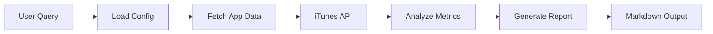

# App Radar Agent 📱

> Automated commercial product research agent for Claude Code that monitors growth trends, user engagement, and business insights of popular mobile apps.

[](https://opensource.org/licenses/MIT)

## Overview

App Radar Agent is a Claude Code subagent that automates competitive intelligence gathering for mobile applications. It tracks key metrics of successful apps like Lemon8, CapCut, Notion, Temu, Duolingo, and Canva to help product managers, founders, and researchers make data-driven decisions.

## Features

- **Automated Monitoring**: Fetches real-time app metrics from app stores
- **Intelligent Analysis**: Generates actionable insights from raw data
- **Multi-Platform**: Supports both iOS and Android applications
- **Configurable**: Easy to customize target apps and regions
- **Report Generation**: Creates structured markdown reports
- **Scheduled Execution**: Can run on-demand or scheduled

## What It Monitors

- App ratings and review counts
- Version update frequency
- Developer information
- Category rankings
- User engagement signals
- Growth trends
- Competitive positioning

## Installation

### For Claude Code Users

1. Copy the agent file to your Claude agents directory:

```bash
# User-level installation (available for all projects)
cp app-radar-agent.md ~/.claude/agents/

# OR project-level installation (specific to one project)
cp app-radar-agent.md .claude/agents/
```

2. Install Python dependencies:

```bash
pip install -r requirements.txt
```

3. The agent will be automatically available in Claude Code. It will activate when you ask about app research, competitive analysis, or market intelligence.

### Standalone Usage

You can also use the scripts independently without Claude Code:

```bash
# Install dependencies
pip install -r requirements.txt

# Run the full pipeline
python scripts/fetch_data.py
python scripts/analyze.py
python scripts/report.py
```

## Configuration

Edit `config.yaml` to customize your monitoring targets:

```yaml
targets:
  - app: Lemon8
    store: ios
  - app: CapCut
    store: ios
  - app: Notion
    store: android
  - app: Temu
    store: ios
  - app: Duolingo
    store: android
  - app: Canva
    store: ios

output_dir: "./data/results"
country_filter: ["US", "JP", "UK"]
```

### Supported Stores

- `ios`: Apple App Store
- `android`: Google Play Store (coming soon)

### Country Codes

Use ISO 3166-1 alpha-2 country codes: `US`, `JP`, `UK`, `CN`, `DE`, `FR`, etc.

## Usage Examples

### With Claude Code

Simply chat with Claude about app research:

```
"Show me the latest metrics for Lemon8"

"Generate a competitive analysis report for video editing apps"

"What monetization strategies are working for CapCut?"

"Track growth trends for productivity apps"
```

The agent will automatically activate and run the analysis.

### Standalone Scripts

```bash
# 1. Fetch latest app data
python scripts/fetch_data.py

# 2. Analyze the data
python scripts/analyze.py

# 3. View the report
cat data/results/appradar_report.md
```

## Output Format

Reports are generated in markdown format with:

| App | Rating | Reviews | Company | Category | Insights |
|-----|--------|---------|---------|----------|----------|
| Lemon8 | 4.5 | 125K | ByteDance | Social | High engagement patterns |
| CapCut | 4.8 | 2.1M | ByteDance | Video | Viral growth strategies |

Each report includes:
- Key metrics comparison
- Growth indicators
- Competitive insights
- "Copiable" strategies (可抄点)
- Actionable recommendations

## Project Structure

```
app-radar-agent/
├── app-radar-agent.md      # Claude Code agent definition
├── README.md               # This file
├── LICENSE                 # MIT License
├── requirements.txt        # Python dependencies
├── config.yaml            # Target apps configuration
├── scripts/
│   ├── fetch_data.py      # App Store data fetcher
│   ├── analyze.py         # Data analysis engine
│   └── report.py          # Report generator
├── data/
│   └── results/           # Generated reports and raw data
└── examples/
    └── sample_report.md   # Example output
```

## Use Cases

### Product Managers
- Monitor competitor feature releases
- Track user sentiment trends
- Identify successful UX patterns

### Founders
- Discover monetization strategies
- Validate market opportunities
- Benchmark against successful apps

### Market Researchers
- Analyze category trends
- Track regional preferences
- Generate competitive intelligence

### Investors
- Monitor portfolio company growth
- Identify emerging winners
- Track market dynamics

## How It Works



1. **Data Collection**: Queries iTunes Search API for app metadata
2. **Analysis**: Processes ratings, reviews, versions, and categories
3. **Insights**: Generates actionable recommendations
4. **Reporting**: Formats results as structured markdown

## API Rate Limits

The agent respects API rate limits with:
- 1 second delay between requests
- Exponential backoff on errors
- Caching of recent results

## Roadmap

- [ ] Google Play Store integration
- [ ] Historical trend tracking
- [ ] Automated alerting on metric changes
- [ ] ML-powered insight generation
- [ ] Multi-language report support
- [ ] Web dashboard interface
- [ ] Slack/Discord notifications

## Contributing

Contributions welcome! Please feel free to submit a Pull Request.

1. Fork the repository
2. Create your feature branch (`git checkout -b feature/AmazingFeature`)
3. Commit your changes (`git commit -m 'Add some AmazingFeature'`)
4. Push to the branch (`git push origin feature/AmazingFeature`)
5. Open a Pull Request

## License

This project is licensed under the MIT License - see the [LICENSE](LICENSE) file for details.

## Acknowledgments

- Built for [Claude Code](https://claude.ai/code) by Anthropic
- Inspired by successful app intelligence tools
- Powered by iTunes Search API

## Support

- Issues: [GitHub Issues](https://github.com/yourusername/app-radar-agent/issues)
- Discussions: [GitHub Discussions](https://github.com/yourusername/app-radar-agent/discussions)

## Author

Created with Claude Code for product teams who want automated competitive intelligence.

---

**Note**: This agent respects app store terms of service and only accesses publicly available data through official APIs.
